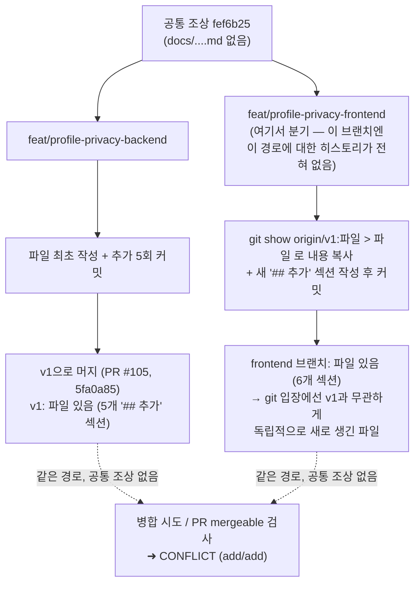

# git show로 다른 브랜치 파일을 복사하면 add/add 충돌이 생기는 이유

## Context

온설 프로필 공개 설정 작업(PR #105 백엔드, PR #106 프론트엔드)에서, 두 PR이 같은 결정 기록 파일(`docs/decisions/2026-08-30-onseol-profile-privacy-decisions.md`)에 라운드마다 `## 추가:` 섹션을 이어붙이는 방식으로 문서를 관리하고 있었다. PR #105가 먼저 머지되면서 v1이 그 파일을 갖게 됐는데, PR #106(`feat/profile-privacy-frontend`)에 새 addendum을 이어붙이려던 시점엔 이 브랜치가 v1보다 먼저 갈라져 나가 있어서 해당 브랜치엔 이 파일 자체가 없었다.

이때 정상적인 방법(`git merge origin/v1`처럼 파일의 히스토리를 실제로 이어받는 것) 대신, `git show origin/v1:docs/....md > docs/....md`로 v1의 파일 **내용만** 복사해 붙여넣고 새 addendum을 이어 쓴 뒤 그대로 커밋했다. 겉보기엔 문제없어 보였다(내용은 v1과 동일 + 새 문단만 추가). 하지만 이후 v1을 다시 병합하려 하자 이 파일 하나에서만 `CONFLICT (add/add)`가 발생했다 — 사용자가 로컬 미리보기용으로 만든 `test` 브랜치에서 먼저 발견됐고, GitHub PR #106도 `mergeable: false`로 나왔다.

## Guidance

다른 브랜치(혹은 거기서 머지된 base 브랜치)에 이미 있는 파일을 지금 작업 브랜치에도 반영해야 한다면, **내용을 복사하지 말고 히스토리를 이어받는다.**

```bash
# ❌ 이렇게 하면 안 됨 — git 입장에선 파일이 "새로 생긴 것"처럼 커밋됨
git show origin/v1:docs/decisions/foo.md > docs/decisions/foo.md
git add docs/decisions/foo.md && git commit

# ✅ 대신 실제로 병합해서 히스토리를 이어받는다
git merge origin/v1
```

파일이 하나뿐이고 로그처럼 뒤에 계속 이어붙는 형식이면, 병합 충돌이 나더라도 사소하다 — 겹치는 앞부분은 자동으로 합쳐지고, 각 브랜치가 뒤에 추가한 부분만 수동으로 합치면 끝난다.

## Why This Matters

git의 3-way 병합은 "공통 조상 커밋에서 각 브랜치가 무엇을 바꿨는지"를 비교해서 자동으로 합친다. `git show ... > file` + 커밋은 그 파일에 대해 **완전히 새로운 히스토리를 시작**시키는 것과 같다 — 공통 조상에 그 경로가 없으니, 두 브랜치가 "각자 독립적으로 새 파일을 추가"한 것으로 보인다. 내용이 한쪽의 완전한 상위집합(superset)이라도 git은 그걸 모르고, 무조건 `add/add` 충돌로 사람이 직접 확인하게 만든다.



이번 경우는 실제로 잃어버린 내용이 없었다 — 충돌 마커의 v1 쪽 블록은 그냥 비어 있었고(v1엔 애초에 그 뒷부분이 없었으니까), 겹치는 부분은 git이 알아서 자동 병합했다. 하지만 같은 파일이 두 브랜치에서 **진짜로 다르게** 발전했다면, add/add 충돌은 정상적인 diff 기반 충돌보다 훨씬 위험하다 — git이 "무엇이 바뀌었는지"를 전혀 모르는 채로 두 파일 전체를 사람이 처음부터 다시 비교해야 한다.

## When to Apply

- 여러 PR/브랜치가 같은 로그성 문서(결정 기록, CHANGELOG 등)에 계속 addendum을 이어붙이는 워크플로를 쓴다.
- 한 브랜치에서 "다른 브랜치엔 있는데 내 브랜치엔 없는 파일"을 급하게 맞추고 싶어서 `git show`/`cat`/에디터 복사-붙여넣기로 파일을 새로 만든다.
- 나중에 그 두 브랜치를 병합하거나, GitHub PR이 base 브랜치 대비 mergeable 상태를 보여줄 때.

## Examples

해결은 `git merge origin/v1` 후 딱 이 파일 하나만 수동으로 정리하면 됐다:

```
$ git merge origin/v1
Auto-merging docs/decisions/2026-08-30-onseol-profile-privacy-decisions.md
CONFLICT (add/add): Merge conflict in docs/decisions/2026-08-30-onseol-profile-privacy-decisions.md
```

충돌 마커 사이 v1 쪽 블록이 비어 있었으므로(v1엔 그 뒷부분이 아예 없었음), 마커 세 줄(`<<<<<<<`/`=======`/`>>>>>>>`)만 지우고 양쪽 내용을 그대로 합치는 걸로 끝났다. 병합 후 `git diff origin/v1 <내-브랜치> -- <파일>`로 이 파일이 v1 대비 순수 추가만 남았는지 확인하는 것도 함께 했다.

## Related

- `docs/decisions/2026-08-30-onseol-profile-privacy-decisions.md`
